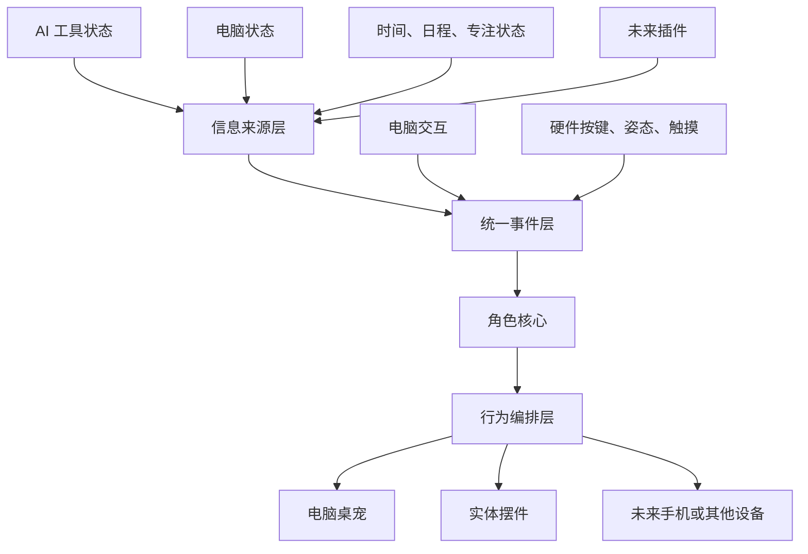

# AI 桌宠产品框架基准

> 文档状态：Approved（产品原则已批准，具体产品选择见《待确认决策清单》）  
> 版本：v0.5  
> 最后更新：2026-08-04

## 1. 文档定位

本文档是电脑桌宠与实体硬件摆件的产品和系统设计基准。后续 PRD、交互设计、软件架构、固件架构、联动协议和硬件选型都应服从本文档定义的产品方向。

硬件外设能力是实现条件和体验素材，不是产品定义本身。不能因为开发板具有某项外设，就反向制造缺乏用户价值的功能。

## 2. 产品定义

产品不定义为“电脑监控器 + 蓝牙硬件”，而定义为：

> 一个角色、两个身体、一个状态核心。

- **一个角色**：用户感知到的是同一个连续角色，而不是屏幕程序和硬件设备两个产品。
- **两个身体**：电脑桌宠负责丰富表达和复杂操作；实体摆件负责环境化表达和实体互动。
- **一个状态核心**：电脑端维护统一的世界状态、角色状态和行为决策，所有终端表达相同语义。

一句话产品定义：

> 一个能够感知 AI 工作过程和电脑情境，通过屏幕角色与实体摆件连续表达，并允许用户进行自然互动的 AI 工作陪伴系统。

## 3. 核心用户价值

首版目标用户是使用一个或多个 AI Agent 完成办公、创作、分析或开发工作的知识工作者。产品大方向收敛为“Agent 工作伴侣”；普通对话 AI 可以通过基础适配接入，但不是第一阶段深度优化对象。

### 3.1 感知 AI 工作过程

用户无需持续盯着 AI 窗口，也能知道 AI 当前正在：

- 空闲；
- 思考；
- 调用工具；
- 等待用户输入或授权；
- 已完成；
- 遇到错误。

### 3.2 让工作状态具有角色感

系统不只显示状态码或性能数据，而是让角色表现出工作、等待、休息、提醒和回应。AI 状态、电脑状态和用户情境都是角色行为的输入。

### 3.3 让实体互动产生真实作用

按键、拿起、放下、翻转、摇晃或触摸等动作，应产生可理解的角色回应，并在适当情况下触发勿扰、展开任务、唤出桌宠等真实操作。

## 4. 非核心定位

以下内容不是产品的核心方向：

- 以 CPU、内存和网络数据展示为主要卖点；
- 将硬件做成 AI 对话全文显示器；
- 为了使用传感器而增加缺乏语义的交互；
- 让硬件独立理解 AI 内容或管理复杂任务；
- 让大模型直接控制安全告警、马达或高风险操作；
- 首版同时覆盖所有 AI 工具、所有系统和所有硬件形态。

电脑状态属于情境输入。例如高负载可让角色表现忙碌，低电量可触发充电提醒，但不应把角色退化为系统仪表盘。

## 5. 总体框架



系统分为信息来源、统一事件、角色核心、行为编排和终端表现五层。终端不能绕过角色核心直接互相控制。

## 6. 信息来源层

信息来源层只回答“发生了什么”，不决定角色如何表现。

输入包括：

- AI 工具状态；
- 电脑负载、电源和网络摘要；
- 用户在电脑上的操作；
- 硬件按键、姿态和触摸事件；
- 时间、日程、专注和勿扰模式；
- 后续扩展插件。

不同 AI 工具必须通过适配器转换为统一状态：

```text
AI_STARTED
AI_THINKING
AI_TOOL_RUNNING
AI_WAITING_USER
AI_COMPLETED
AI_FAILED
```

新增 AI 工具时只增加适配器，不修改桌宠渲染器、硬件驱动或角色核心。

## 7. 统一事件层

所有输入统一转换成领域事件，再进入角色核心：

```json
{
  "source": "ai.codex",
  "type": "ai.waiting_user",
  "importance": 80,
  "task_id": "task-123",
  "timestamp": 1785750000000,
  "data": {
    "reason": "permission_required"
  }
}
```

统一事件层负责：

- 事件格式与版本；
- 来源标识；
- 时间戳和任务关联；
- 去重、合并、节流；
- 事件优先级；
- 日志和可观测性。

明确禁止以下直接依赖：

- AI 适配器直接控制硬件灯光；
- 桌宠 UI 直接操作 BLE；
- 固件按键事件直接批准 AI 高风险操作；
- 系统监控模块直接改变角色动画。

## 8. 角色核心

角色核心负责回答“角色现在处于什么状态”。它是系统状态的权威来源。

角色状态由四部分构成：

```text
角色状态 = 基础情绪 + 当前活动 + 临时反应 + 重要提醒
```

示例：

```text
基础情绪：平静
当前活动：帮助用户执行 AI 任务
临时反应：刚被用户拿起
重要提醒：AI 正在等待确认
```

角色需要优先表达“等待确认”，同时可以叠加被拿起后的局部反应。

### 8.1 实现原则

- 首版使用确定性状态机和规则系统；
- 所有行为具有优先级、持续时间、可否打断和恢复策略；
- 安全状态和用户待处理事项不能被普通互动覆盖；
- 大模型可以生成台词或个性化内容，但不能绕过规则、权限与安全状态；
- 角色核心不依赖某一种硬件能力。

## 9. 行为编排层

行为编排层负责把角色状态转换为抽象行为意图：

```json
{
  "behavior": "ai.waiting_user",
  "priority": 80,
  "intensity": 0.7,
  "duration": "until_state_change"
}
```

各终端根据自身能力表达同一语义，不要求播放完全相同的动画。

| 行为语义 | 电脑桌宠 | 实体摆件 |
|---|---|---|
| AI 思考 | 思考动画、任务标记 | 呼吸灯、表情或轻动作 |
| 工具执行 | 工作动画、任务入口 | 节奏灯效或执行动画 |
| 等待用户 | 气泡显示原因和操作入口 | 明确但克制的提醒 |
| 完成 | 展示结果入口 | 短暂成功反馈 |
| 错误 | 错误摘要和处理入口 | 可辨识的错误表现 |
| 用户拿起 | 屏幕角色同步回应 | 本地即时反馈 |
| 勿扰 | 降低弹出和动画频率 | 降亮度、静音、停止大动作 |

行为编排输出语义和约束，不持续下发像素帧、传感器原始数据或马达轨迹。

## 10. 两个身体的责任

### 10.1 电脑桌宠：丰富表达和复杂操作

电脑端负责：

- 显示文字、任务详情和错误原因；
- 展示聚合状态、会话详情和当前焦点会话；硬件端完整任务管理属于后续能力；
- 打开对应窗口或文件；
- 配置角色、设备和权限；
- 承担复杂动画和对话；
- 完成涉及上下文、权限或风险的确认；
- 维护统一状态和行为决策。

### 10.2 实体摆件：环境表达和自然互动

硬件端负责：

- 用户不看屏幕时表达关键状态；
- 通过灯光、表情和动作提供陪伴感；
- 采集按键、拿起、翻转、触摸等实体互动；
- 本地完成低延迟反馈；
- 快速进入勿扰、静音或唤出桌宠；
- 断连后保留基础角色行为；
- 本地执行电源、温度、马达和其他设备安全保护。

硬件端不负责：

- 展示大量文字；
- 理解完整 AI 对话；
- 管理复杂任务；
- 保存提示词、回复或工作文件内容；
- 作为系统状态的最终权威；
- 直接批准高风险或不可逆操作。

## 11. 电脑端产品界面

电脑端分为三个界面层级。

### 11.1 桌宠窗口

日常可见，保持克制：

- 角色动画；
- 简短气泡；
- 拖动、点击和穿透切换；
- 任务状态提示；
- 快速展开当前任务。

### 11.2 托盘与快速面板

承载高频控制：

- 勿扰模式；
- 显示或隐藏桌宠；
- 当前 AI 任务；
- 硬件连接状态；
- 暂停状态监控；
- 打开控制中心。

### 11.3 控制中心

承载低频复杂配置：

- AI 工具接入；
- 硬件配对、诊断和升级；
- 角色与动作资源包；
- 硬件互动映射；
- 权限和隐私；
- 日志导出；
- 后续插件管理。

不能把所有设置都放入桌宠气泡，否则桌宠会退化为低效率的系统菜单。

## 12. 硬件交互设计原则

硬件首先是角色载体，其次才是外设集合。交互必须从角色语义出发：

| 用户动作 | 角色含义 | 推荐产品作用 |
|---|---|---|
| 单击 | 呼叫角色 | 唤出桌宠或展开当前任务 |
| 长按 | 要求安静或安抚角色 | 切换勿扰模式 |
| 拿起 | 关注角色 | 进入近距离互动并提示详细状态 |
| 放下 | 结束互动 | 返回环境表达 |
| 翻转 | 暂时不想被打扰 | 临时静音或暂停提醒 |
| 摇晃 | 强烈呼叫 | 唤出电脑端桌宠，不执行危险操作 |
| 遮挡环境光 | 让角色休息 | 进入低亮休息状态 |

交互映射必须可配置，并提供误触保护。不能仅因为硬件可以识别摇晃，就强行加入摇晃功能。

## 13. 联动协议边界

产品协议围绕三类信息设计。

### 13.1 状态同步

电脑向硬件同步：

- AI 当前状态；
- 电脑状态摘要；
- 用户模式；
- 角色主状态；
- 连接和时间状态。

### 13.2 行为命令

电脑向硬件发送：

- 播放抽象行为；
- 停止或替换行为；
- 进入勿扰；
- 更新配置；
- 更新角色资源。

### 13.3 互动事件

硬件向电脑上报：

- 按键单击、双击或长按；
- 拿起、放下、翻转或摇晃；
- 触摸事件；
- 设备健康和异常。

硬件应本地处理滤波、去抖和手势识别，只上报语义事件。原始传感器流只允许在限时调试模式使用。

## 14. 扩展框架

首版预留扩展点，但不立即建设开放市场。

### 14.1 AI Adapter

接入 Codex、ChatGPT、Claude、本地模型、IDE Agent 等不同工具，并映射为统一 AI 状态。Codex 是首个参考适配器，不是产品专用依赖。

AI 接入采用分级能力模型：

- **标准接入**：AI 提供事件、插件、API 或结构化日志，可准确报告任务状态并定位任务。
- **配置接入**：用户配置进程、窗口、日志规则或 Webhook，只承诺配置规则能够观察到的状态。
- **基础接入**：只能启动、唤出或判断应用是否运行，不声称能够识别其内部思考、工具调用或等待状态。

产品可以允许用户配置任意 AI，但状态准确度必须按接入等级明确展示，不能将推断结果伪装为可信事件。

### 14.2 Character Pack

定义：

- 电脑端动画；
- 硬件端资源；
- 抽象行为映射；
- 台词风格；
- 默认行为参数。

### 14.3 Device Profile

支持不同硬件能力等级：

```text
RGB
RGB + 屏幕
RGB + 屏幕 + 马达
完整多模态摆件
```

### 14.4 Interaction Binding

将硬件事件映射为产品动作，例如：

```text
长按 -> 勿扰
拿起 -> 展开当前任务
翻转 -> 临时静音
双击 -> 角色回应
```

扩展只能提出动作请求，最终由权限系统决定是否允许执行。

## 15. MVP 基准

MVP 的目标不是证明“桌宠很智能”，而是证明角色在两个身体之间具有连续性。

MVP 使用“多会话观察 + 一个焦点会话”模型：系统同时保存和展示多个 Agent 会话，聚合状态用于总览；任一时刻只有一个焦点会话驱动角色细节、提醒和快捷唤出。硬件显示聚合状态、任务数量和焦点标记，不承担完整会话管理。

焦点优先级为：用户锁定 > 等待用户/审批 > 错误 > 最近工具执行 > 最近运行 > 最近完成 > 空闲。用户锁定的焦点不会被普通状态变化抢占；焦点失效后按规则重新选择。

必须完成以下闭环：

1. 用户在电脑上启动一个 AI 任务。
2. 屏幕桌宠和实体摆件进入统一的工作状态。
3. AI 调用工具时，两端切换为执行表现。
4. AI 等待用户时，摆件给出明确而克制的提醒。
5. 用户拿起或按下摆件。
6. 硬件立即本地反馈，屏幕桌宠同步回应并展开待处理内容。
7. 用户在电脑上查看上下文并确认。
8. 任务完成后，两端共同反馈并恢复待机。
9. 电脑休眠或连接中断后，摆件进入明确的离线休息状态。

当前 MVP 硬件需要：

- 显示屏及屏幕交互；
- 扬声器；
- 麦克风硬件；
- BLE；
- 功能键；
- IMU；
- 环境光；
- RGB 状态指示。

麦克风采音默认关闭，MVP 只完成权限、自检和不可被角色动画覆盖的采音指示，不开放采音用户功能。震动执行器进入 MVP 提醒链路，复杂机械动作和电池可以随后加入。当前产品要求屏幕存在，但 UI 与角色资源必须自适应分辨率，协议和角色核心通过能力协商避免绑定某个具体屏幕规格。

## 16. 当前需要冻结的产品决策

| 决策 | 推荐基准 | 原因 |
|---|---|---|
| 角色定位 | 工作伙伴，带适度情绪陪伴 | 兼顾效率、陪伴与实体操作价值 |
| AI 范围 | 可配置接入多种 AI，Codex 为首个参考 | 产品不绑定单一 AI，同时按接入等级声明准确度 |
| 首批硬件交互 | 功能键、拿起/放下、翻转、屏幕交互 | 覆盖主动、关注、勿扰和直接操作 |
| 提醒风格 | 一级界面+RGB，二级增加震动，三级增加强化震动和声音/语音，勿扰仅 RGB | 用户可选择等级，兼顾及时性与低打扰 |
| 硬件输出 | 自适应屏幕、扬声器、RGB、震动 | 形成完整角色表达，具体器件待硬件 spike |
| 麦克风 | 硬件进入 MVP，采音默认关闭 | 保留扩展价值，同时维持隐私边界 |
| 电脑状态 | 可选显示 | 用户选择采集范围、指标与展示方式 |
| 角色资源 | 允许用户导入资源包 | 需要资源规范、安全校验和版权声明 |

Codex 参考适配器覆盖桌面端、CLI 与 IDE 插件形态；每种形态独立声明可用能力，不要求三种形态具有完全相同的状态精度。
| AI 操作确认 | 电脑桌宠可在展示工具和摘要后允许/拒绝；硬件只唤出电脑上下文 | 复用现有审批闭环，同时避免小屏无上下文审批 |

## 17. 架构验收原则

后续设计方案需要同时满足：

1. 新增 AI 工具只需增加适配器。
2. 更换开发板或减少硬件外设时，角色核心不需重写。
3. 屏幕桌宠重启不应改变角色语义或造成硬件危险动作。
4. 硬件断连后仍能本地回应，但不会伪装为在线状态。
5. 同一状态在两个身体上的表达可以不同，但用户理解必须一致。
6. 大模型输出不能绕过权限、优先级和设备安全规则。
7. 用户可以明确关闭监控、互动、设备连接和未来麦克风能力。

## 18. 核心结论

产品框架不是简单的“PC 主控 + MCU 从机”，而是：

> 电脑维护统一世界状态、角色人格和行为决策；实体摆件作为具有本地反射与安全自治能力的角色身体；双方通过语义事件和行为意图联动。

后续所有功能都应回答三个问题：

1. 它为用户提供了什么明确价值？
2. 它属于信息来源、角色决策还是终端表达？
3. 没有某个特定硬件外设时，产品核心是否仍然成立？
