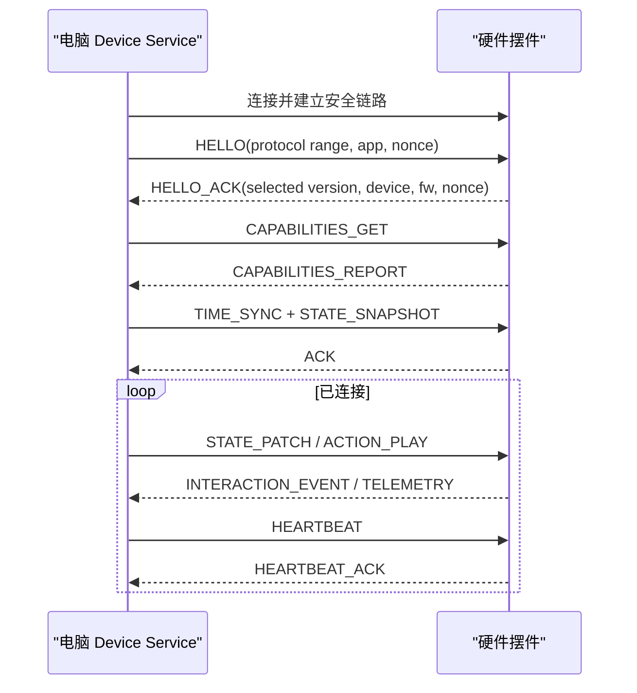

# 电脑端与摆件联动协议演进设计

> 文档状态：Technical Draft  
> 文档版本：v0.3  
> 最后更新：2026-08-04  
> 已实现协议唯一规范：`agent-pet-sf32/docs/agent-pet-hardware-protocol-v1.md`

## 0. 协议路线

当前产品已有跨端实现和自动测试通过的 Agent Pet 硬件协议 v1：

- BLE Central：`agent-pet`；
- BLE Peripheral：`agent-pet-sf32`；
- 固定 20 字节帧、CRC-8/ATM；
- 完整状态快照，最多 12 个会话；
- 时间同步；
- 336×336 JPEG 资源同步及原子落盘；
- 断连保留最后快照并明确显示离线；
- 外设不能批准、拒绝或修改 Agent 任务。

因此协议采用兼容演进：

| 层 | 当前选择 |
|---|---|
| v1 数据面 | 保留现有 20 字节帧，继续承担状态、时间和图片同步 |
| v1 扩展消息 | 只增加能够保持旧固件安全忽略的新 message type |
| v2 控制面 | 能力协商、双向硬件事件、提醒等级、音频、设备健康和资源 manifest |
| 调试/恢复 | CH340N 串口，不作为用户产品链路 |

下文描述的是 v2 目标消息模型。除明确标注外，不代表已经实现，也不能替代冻结的 v1 规范。

## 1. v2 设计目标

- 业务语义与 BLE、串口和未来传输解耦，同时保留 v1 BLE 兼容性。
- 兼容未知的新字段、新动作和不同能力的设备。
- 能处理丢包、重连、重复命令、旧固件和资源传输。
- 正常状态变化低延迟，不能以高频逐帧流量消耗 MCU 和无线带宽。

非目标：远程互联网控制、音视频流、将提示词或回复正文同步到摆件。

## 2. 分层

| 层 | 职责 |
|---|---|
| 业务模型 | 状态、动作、互动、设置、升级和诊断语义 |
| 消息层 | 类型、请求关联、版本、确认、错误和幂等 |
| 编码层 | v2 候选使用 CBOR；字段使用稳定数字键，调试工具可显示为 JSON |
| 传输层 | v1 固定 GATT 帧；v2 BLE GATT 控制/事件通道；UART 仅开发/恢复 |

业务模型不得依赖 BLE 特有概念。BLE MTU、分片和 characteristic 只存在于传输层。

## 3. 连接生命周期



每次重连必须重新握手、协商版本和获取能力。电脑随后发送完整快照，不能假设设备还保持断连前状态。

## 4. 消息信封

以下用可读 JSON 表达；这是 v2 候选模型，线上编码待资源和吞吐 spike 后冻结：

```json
{
  "v": 2,
  "type": "action.play",
  "id": 1042,
  "reply_to": null,
  "ts_ms": 1785750000123,
  "ttl_ms": 3000,
  "flags": ["ack_required"],
  "body": {}
}
```

| 字段 | 规则 |
|---|---|
| `v` | 已协商的主版本 |
| `type` | 稳定消息类型；未知类型返回 `unsupported_message` |
| `id` | 发送方单调递增 `uint32`，回绕后按序号规则处理 |
| `reply_to` | 响应关联的请求 ID，无则省略 |
| `ts_ms` | 电脑 Unix 毫秒；无可靠时钟的硬件可用同步后的估算值 |
| `ttl_ms` | 过期命令不得执行；配置和资源消息可省略 |
| `flags` | `ack_required`、`response`、`error` 等 |
| `body` | 按类型定义；接收方必须忽略未知可选字段 |

收到重复的可执行消息 ID 时不得再次执行，应返回缓存的 ACK/结果。ACK 只表示接收并通过基础校验；需要执行结果的命令另发 `action.result`。

## 5. 核心消息

### 5.1 会话与设备

- `session.hello` / `session.hello_ack`
- `device.capabilities_get` / `device.capabilities_report`
- `device.time_sync`
- `device.heartbeat` / `device.heartbeat_ack`
- `device.telemetry`
- `device.error`

能力报告示例：

```json
{
  "device_id": "dp-7f23...",
  "model": "huangshan-dev-v1",
  "fw": "0.3.0",
  "protocol": 1,
  "capabilities": {
    "display": {"width": 240, "height": 240, "format": ["rgb565"]},
    "rgb": {"count": 2},
    "input": ["button.single", "button.long", "imu.pose", "imu.gesture", "ambient_light"],
    "sensors": {"imu_6axis": true, "magnetometer_3axis": true, "ambient_light": true, "microphone": "disabled_by_policy"},
    "motion": {"driver_present": true, "actuator_attached": false},
    "audio": {"microphone_present": true, "amplifier_w": 3, "speaker_attached": false},
    "storage": {"tf_card": true},
    "ota": {"supported": true, "rollback": false},
    "max_message": 4096,
    "resource_free": 524288
  }
}
```

示例数字仅用于说明，实际值必须由 SF32BL52 黄山派原型测量，不能硬编码到电脑端。

### 5.2 状态同步

- `state.snapshot`：连接、重连或状态代际变化后发送完整状态。
- `state.patch`：只发送变化字段，包含 `generation` 和递增 `revision`。
- `state.applied`：硬件报告已应用的 revision。

```json
{
  "generation": "6f89b4a2",
  "revision": 31,
    "ai": {"state": "tool_running", "intensity": 0.8, "task_id": "task-123"},
  "computer": {"load": "busy", "power": "ac", "network": "online"},
  "mode": "normal"
}
```

设备发现 revision 跳号时请求 `state.resync`; generation 改变时丢弃旧 patch 并等待 snapshot。不得对所有字段笼统采用“最后写入生效”，状态所有权按下表处理。

| 字段 | 权威方 | 重连规则 |
|---|---|---|
| AI、电脑和角色状态 | 电脑 | 使用电脑完整快照覆盖硬件缓存 |
| 连接、传感器、故障、电源和执行器安全状态 | 硬件 | 硬件重新上报，电脑不得覆盖安全状态 |
| 用户模式 | 最近一次明确用户操作 | 使用 `revision + changed_at + origin` 合并，电脑持久化最终结果 |
| 临时动作和互动瞬态 | 不持久化 | 重连后不恢复、不重放 |
| 配置 | 每个字段在 schema 中声明 owner | 未声明 owner 的字段拒绝同步 |

硬件断连期间可以本地切换临时勿扰，并记录一次带版本的用户模式变更；重连时先上报该变更，再由电脑确认合并结果和发送最终快照。其他角色状态仍以电脑快照为准。

### 5.3 行为命令

- `action.play`：播放抽象动作。
- `action.stop`：按实例或通道停止。
- `action.result`：`started / completed / interrupted / expired / unsupported / failed`。

```json
{
  "instance_id": "act-1042",
  "action": "ai.thinking",
  "channels": ["display", "light", "motion"],
  "intensity": 0.7,
  "duration_ms": 0,
  "priority": 50,
  "interrupt": "replace_lower",
  "fallback": "generic.busy",
  "params": {}
}
```

`duration_ms=0` 表示持续至状态改变或 stop。设备可根据能力忽略某个 channel，但必须回报 `applied_channels`。电脑端发送动作 ID，不发送资源文件路径。

### 5.4 硬件互动

- `interaction.event`
- `interaction.feedback`（电脑确认已接收，可带后续语义）

```json
{
  "event_id": 883,
  "input": "touch.tap",
  "target": "head",
  "phase": "complete",
  "value": 1,
  "device_uptime_ms": 920044,
  "local_feedback": "pet.happy"
}
```

硬件负责消抖和识别单击、双击、长按等基础手势；电脑负责把手势解释为“切换专注模式”等产品动作。涉及权限或不可逆操作时，事件只能唤起电脑端确认，不能直接授权。

### 5.5 配置、资源和升级

- `config.get / config.set / config.report`
- `resource.manifest / resource.begin / resource.chunk / resource.commit`
- `firmware.check / firmware.begin / firmware.chunk / firmware.commit / firmware.status`

资源和固件传输使用独立 bulk 通道、分块哈希和整体 SHA-256。固件包必须签名，设备仅接受匹配型号且版本策略允许的镜像。升级过程中普通表现降级，断电后应能启动旧版本或恢复模式；若原型无法支持双分区，必须把该风险列入硬件放行条件。

## 6. BLE GATT 建议

自定义 128-bit Service，至少三个 characteristic：

- `Control RX`：电脑写入小型命令。
- `Event TX`：硬件 notify 状态、互动和响应。
- `Bulk`：资源、日志和升级，可双向。

大于单次 ATT 有效载荷的消息使用 4 字节分片头：`message_id uint16 + fragment_index uint8 + fragment_count uint8`。发送窗口、超时和最大重组尺寸由握手协商。优先协商较大 MTU，但实现不得假定固定 247 字节 MTU。

配对要求：BLE LE Secure Connections；首次绑定需要实体在场证明（按键长按或设备显示确认信息）。绑定清除必须通过实体操作，避免旧电脑永久控制设备。具体 BLE 能力和 SDK API 需在黄山派实板 spike 中确认。

## 7. CH340N 串口建议

开发板资料明确列出 CH340N USB 转串口，使用 `COBS(frame) + 0x00` 定界，帧内为 CBOR 消息并附 CRC32。串口承担烧录、开发日志、故障恢复、工厂测试，也可作为 BLE 协议调试的有线适配器，但产品功能不得只能通过串口使用。

Type-C 标注为 5V/2A USB 供电，不能仅凭该信息认定其数据线连接 MCU 或支持原生 CDC/DFU。量产板是否保留 CH340N、是否增加 MCU USB 数据链路，需要结合成本和恢复方案另行决定。

## 8. 时序、可靠性和限流

- 交互本地反馈：按下后 50 ms 内；事件到电脑目标 200 ms 内。
- AI 状态到双端开始表达：目标 500 ms，P95 小于 1 秒。
- 心跳：正常 5 秒；连续 3 次无响应判定断连。低功耗模式可重新协商。
- 高频指标在电脑端聚合；普通遥测不超过 1 Hz，无变化时降到每 30 秒。
- 同类 state patch 100 ms 窗口合并；告警和用户输入不合并。
- 错误采用稳定代码，如 `invalid_payload`、`unsupported_action`、`busy`、`expired`、`storage_full`、`unsafe_state`。

## 9. 版本策略

- 主版本不兼容；握手选择双方共同支持的最高主版本。
- 同主版本只新增可选字段、消息或能力，不改变已有字段语义。
- 动作名称采用命名空间，如 `core.ai.thinking`、`vendor_x.weather.rain`。
- 电脑端至少兼容当前和前一协议主版本；固件能力不足时显式降级，不静默误执行。

## 10. 协议测试要求

- v1 使用固定 golden vectors 验证 PC 与固件 20 字节帧编解码一致；v2 候选另建 CBOR golden vectors，不能混用两套测试。
- 覆盖乱序/重复/丢失分片、断连重连、序号回绕、未知字段、超大消息和过期命令。
- 模糊测试解析器，所有长度在分配内存前校验。
- 提供软件设备模拟器，使电脑端开发不依赖实物板；提供 PC 协议模拟器供固件 CI 使用。
