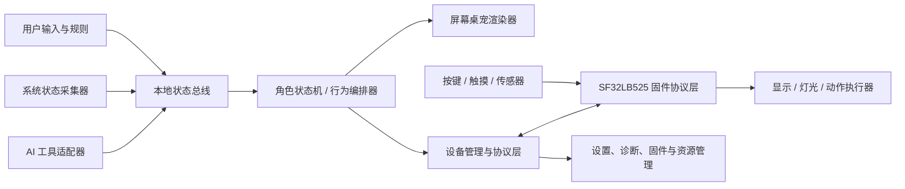

# 产品边界与系统架构

> 文档状态：Draft（架构边界已确定，用户与 AI 接入选择待确认）  
> 版本：v0.4  
> 最后更新：2026-08-04

> 硬件基线：芯片型号为 `SF32LB525`，SiFli SDK 固件构建目标为 `sf32lb52-lchspi-ulp`。

## 1. 产品目标

### 1.1 核心价值

1. 用户无需切换窗口，就能通过桌宠的动作、表情和灯效知道 AI 正在等待、思考、调用工具、成功或出错。
2. 屏幕桌宠和实体摆件表现为同一个角色，而非两个独立设备。
3. 实体交互能产生真实作用，例如暂停提醒、唤出焦点会话、切换专注模式或安抚角色。电脑桌宠可以显示完整工具摘要后完成审批，MVP 不通过硬件直接批准 AI 操作。
4. 设备断连、电脑休眠、程序崩溃时仍有可解释、不过度打扰的行为。

### 1.2 首要用户

经常使用一种或多种 AI 工具完成办公、创作、分析或开发任务的知识工作者。首版优化 Windows 单机桌面使用；Codex 作为参考接入，跨平台作为后续目标。

## 2. 责任划分

| 能力 | 电脑桌宠 | 硬件摆件 | 说明 |
|---|---|---|---|
| AI 状态采集 | 主责 | 不负责 | 通过适配器接入 AI 工具事件，不依赖硬件理解 AI |
| CPU/内存/电量/网络状态 | 主责 | 仅接收摘要 | 不向硬件发送进程列表、提示词等敏感原始数据 |
| 角色状态机与行为编排 | 权威源 | 缓存并执行 | 情绪、场景、动作优先级由电脑端统一决定 |
| 屏幕动画、悬浮交互 | 主责 | 不负责 | 窗口穿透、拖拽、托盘、桌面渲染均在电脑端 |
| 灯效、屏幕、舵机/振动执行 | 下发意图 | 主责 | 硬件将抽象动作映射为板级驱动 |
| 触摸、按键、姿态等采集 | 接收并解释 | 权威源 | 硬件完成去抖、长按/双击识别和时间戳 |
| 电源、温度、限位保护 | 不可覆盖 | 主责 | 安全策略必须在本地闭环，电脑命令不能绕过 |
| 配置与资源管理 | 主责 | 保存设备必要配置 | 用户配置、资源包和固件升级从电脑端管理 |
| 断连行为 | 显示离线 | 主责 | 使用最近角色资源进入离线动作，不伪装在线 |
| 固件升级 | 发起、校验包 | 接收、双分区/回滚 | 是否支持双分区需根据 Flash 资源验证 |
| 日志诊断 | 汇总与脱敏 | 环形日志 | 默认不记录提示词、AI 回复正文和键盘内容 |

**边界原则：**电脑端发送“表达意图”，例如 `thinking + intensity=0.7`，硬件负责把它变成自己的灯效/动画；不要持续下发每一帧像素或舵机角度。只有调试和资源下载走低层控制。

## 3. 逻辑架构

### 3.1 电脑端模块

- **AI Adapter SDK**：把不同 AI 工具映射为统一事件。优先使用官方事件、插件或本地 API；进程检测只能推断“运行中”，不能声称“正在思考”。
- **System Monitor**：按低频采样 CPU、内存、电源、网络和前台应用类别，输出摘要状态。
- **State Bus**：统一事件格式、节流、去重和可观测性。
- **Character Engine**：维护角色状态并仲裁冲突，例如“错误提醒”高于“摸头回应”，“设备过温”高于全部表现命令。
- **Screen Renderer**：透明窗口、拖拽、点击穿透、动画和气泡；不承载设备通信逻辑。
- **Device Service**：发现、配对、连接、协议、升级、资源同步和诊断。
- **Control Center**：托盘入口、隐私开关、设备管理、动作映射和日志导出。

AI Adapter SDK 必须支持标准接入、用户配置接入和基础启动/唤出接入三种等级，并在控制中心显示每个适配器能可靠提供的状态集合。

电脑端建议采用守护服务与 UI 分离的进程边界。UI 重启时设备连接和 AI 监控不应全部中断。具体技术栈在完成动画格式和内存基线验证后决定。

### 3.2 固件模块

- 板级支持包（BSP）：SF32LB525/黄山派外设、时钟、Flash 和低功耗。
- 设备抽象层（HAL）：显示、RGB、马达/舵机、触摸、按键、IMU、蜂鸣器等能力接口。
- 协议与连接：BLE GATT 为产品链路；CH340N USB 转串口用于烧录、日志、调试和必要的有线协议适配。除非原理图证明 MCU D+/D- 另有连接，否则不按原生 USB CDC 设计。
- 表达引擎：动作资源播放、灯效、过渡和优先级队列。
- 本地交互：去抖、手势识别、事件上报与离线回应。
- 设备管理：配对信息、配置、日志、看门狗、升级和回滚。

当前开发板原生传感输入较丰富：六轴 IMU、三轴地磁、环境光、MEMS 麦克风和功能键；板载 RGB 可作为最低保真度输出。屏幕/触摸通过 22Pin FPC 扩展，马达只有驱动电路和外接焊点，音频有功放但仍需确认扬声器/负载，因此这些能力均应通过运行时能力报告声明。

所有板级差异收敛在 BSP/HAL；上层只查询能力，不直接判断“黄山派”型号。

## 4. 统一状态模型

状态采用四个正交状态域，不能把 AI 活动、设备连接、用户模式和互动瞬态放入同一个枚举：

| 状态域 | 权威方 | 作用 |
|---|---|---|
| AI 活动状态 | 电脑端 AI Adapter / 角色核心 | 描述聚合状态与焦点会话当前阶段 |
| 设备连接状态 | Device Service 与硬件各自观察、握手收敛 | 描述摆件是否可用 |
| 用户模式 | 最近一次有效用户操作，电脑端持久化 | 描述正常、专注或勿扰策略 |
| 互动瞬态 | 产生事件的终端 | 描述拿起、按键等短时反应，不作为持久主状态 |

### 4.1 AI 状态

| 状态 | 含义 | 建议表现 |
|---|---|---|
| `unavailable` | 未接入或监控不可用 | 不显示 AI 活跃指示 |
| `idle` | 已接入，当前无任务 | 呼吸/待机 |
| `waiting_user` | 需要输入、授权或选择 | 明确提示，间歇提醒 |
| `thinking` | 模型正在生成或规划 | 连续思考动作 |
| `tool_running` | 工具、命令或外部操作执行中 | 工作动作，可带进度 |
| `success` | 本轮完成 | 短暂成功反馈后回待机 |
| `error` | 本轮失败或连接异常 | 可区分可恢复/需用户处理 |

MVP 同时观察多个 Agent 会话，并计算聚合状态、会话数量和一个焦点会话。聚合状态用于总览；焦点会话驱动角色细节、提醒和快捷唤出。硬件可以显示任务数量，但不承担完整会话列表管理或审批。

### 4.2 电脑状态

只下发语义化等级，不发送原始敏感数据。电脑状态展示默认可配置，用户可以关闭全部采集，或选择具体指标与展示位置：

- 负载：`normal / busy / stressed`，带 0-100 可选强度。
- 电源：`ac / battery / low / critical / charging`。
- 网络：`online / degraded / offline`。
- 专注：`off / focus / do_not_disturb`。

### 4.3 角色状态

角色状态由 `base mood + activity + transient reaction + alert` 叠加。每个表现具有优先级、持续时间、可否打断和恢复策略，避免 AI 状态、摸头和低电量同时抢占执行器。

推荐优先级：设备安全 100，需用户处理 80，系统告警 70，AI 活动 50，用户即时互动 40，环境/待机 10。互动可在不遮蔽告警的前提下叠加局部效果。

### 4.4 设备、用户模式与互动状态

- 设备连接：`disconnected / connecting / connected / degraded / updating`。
- 用户模式：`normal / focus / do_not_disturb`。
- 互动瞬态：`button_pressed / picked_up / put_down / flipped / shaken` 等事件；处理完成后消失，不参与持久状态枚举。
- `offline` 仅用于设备连接或网络状态，不能作为 AI 活动状态；AI 来源不可用使用 `unavailable`。

## 5. 数据与隐私边界

- 默认只采集用户已开启的状态指标，不采集提示词、回复正文、文件内容、键盘输入、剪贴板和屏幕画面。麦克风硬件进入 MVP，但采音默认关闭；启用具体功能必须显式授权，并提供持续可见且不可被普通动画覆盖的采音指示。
- 每个 AI 适配器必须显示其数据来源和权限；用户可逐个关闭。
- 对外发送的数据必须另行显式授权；首版不依赖云端账户即可工作。
- 日志使用事件类型、耗时、错误码和匿名设备 ID；用户导出前可预览。
- 摆件只保存配对凭据、必要设置、资源版本和有限环形诊断日志。

## 6. 扩展机制

扩展点按稳定性从高到低分层：

1. **AI Adapter**：输入统一 AI 状态事件。
2. **System Sensor**：输入新的电脑/环境状态。
3. **Action Pack**：为抽象动作提供屏幕与硬件资源映射。
4. **Interaction Binding**：把硬件手势映射为电脑动作，需权限声明。
5. **Device Profile**：声明新硬件的能力及限制。

首版扩展通过带版本的 manifest 和受限 API 加载。第三方扩展不直接获得设备句柄、任意文件访问或任意命令执行权。

## 7. 关键场景

1. AI 开始思考：适配器产生事件，角色引擎切换活动，屏幕和硬件在目标 500 ms 内开始一致反馈。
2. AI 请求授权：两端进入等待表现；电脑桌宠可展示工具与摘要并完成允许/拒绝，用户点击或拿起硬件只负责唤出焦点会话。
3. 用户摸头：硬件本地立即反馈，随后上报电脑；电脑角色状态同步，而不是等待链路往返才动。
4. 蓝牙断连：摆件在 2 秒内显示离线状态，保留本地互动；电脑端后台重连，不频繁弹窗。
5. 电脑休眠：主动发送休眠意图；摆件进入低打扰模式。异常掉线则按超时进入离线状态。
